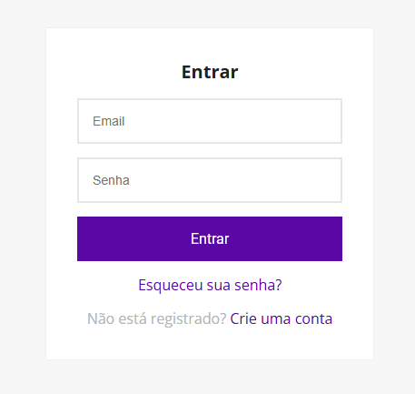

<<<<<<< HEAD
# CRUD-Project
crud com laravel e react
=======
# CRUD de Usuários com Recuperação de Senha - Laravel & React

## Descrição

Este é um projeto CRUD desenvolvido com **PHP 8.2.12**, **Laravel 10**, e **MySQL**. O sistema implementa a criação, leitura, atualização e exclusão de registros de usuários, incluindo funcionalidades de **autenticação com Laravel Sanctum** e **recuperação de senha com envio de e-mails utilizando Mailtrap**. O front-end foi desenvolvido em **React**.

Este repositório serve como um exemplo de como criar uma API de autenticação e gerenciamento de usuários, além de implementar funcionalidades de recuperação de senha seguras com Laravel.

## Funcionalidades

- **CRUD de Usuários**: Permite criação, leitura e atualização de usuários.
- **Autenticação de Usuários**: Usuários podem se autenticar utilizando **Laravel Sanctum**.
- **Recuperação de Senha**: Usuários podem solicitar a recuperação de senha através do envio de um link para redefinir a senha por e-mail.
- **Validação de E-mail**: O e-mail de recuperação é enviado via **Mailtrap** durante o desenvolvimento.
- **Segurança**: Implementação de boas práticas de segurança, como a criptografia de senhas.

## Tecnologias Utilizadas

- **PHP**: 8.2.12
- **Laravel**: 10
- **Laravel Sanctum**: 3.2
- **MySQL**: Banco de dados relacional utilizado
- **React**: Biblioteca JavaScript para o front-end
- **Mailtrap**: Para envio de e-mails de recuperação de senha (ambiente de testes)
- **Composer**: Para gerenciamento de dependências do Laravel
- **Node.js**: Para o React
- **NPM/Yarn**: Para gerenciar pacotes no front-end

## Como Configurar o Projeto

### Requisitos

- **PHP 8.2.12** ou superior
- **Composer**
- **MySQL**
- **Node.js** (para React)
- **NPM** (para gerenciar pacotes no front-end)
- **Conta no Mailtrap**

### Passos para Instalação

#### 1. Back-End (Laravel)

1. Clone o repositório:

   bash
   git clone https://github.com/seu-usuario/seu-repositorio.git
   

2. Acesse o diretório do Laravel:

   bash
   cd \laravel_react
   

3. Instale as dependências do Laravel:

   bash
   composer install
   

4. Crie o arquivo `.env` a partir do `.env.example`:

   bash
   cp .env.example .env
   

5. Configure as variáveis de ambiente no arquivo `.env`:

	dotenv
   DB_CONNECTION=mysql
   DB_HOST=127.0.0.1
   DB_PORT=3306
   DB_DATABASE=crud_db
   DB_USERNAME=root
   DB_PASSWORD=

   FRONTEND_URL=http://localhost:5000

   MAIL_MAILER=smtp
   MAIL_HOST=smtp.mailtrap.io
   MAIL_PORT=2525
   MAIL_USERNAME=seu-usuario
   MAIL_PASSWORD=sua-senha
   MAIL_ENCRYPTION=tls
   MAIL_FROM_ADDRESS=noreply@crudproject.com
   MAIL_FROM_NAME="${APP_NAME}"
   

6. Gere a chave da aplicação:

   bash
   php artisan key:generate
   

7. Execute as migrações do banco de dados:

   bash
   php artisan migrate
   

8. Inicie o servidor de desenvolvimento:

   bash
   php artisan serve
   

#### 2. Front-End (React)

1. Acesse a pasta do front-end:

   bash
   cd react_laravel_crud
   

2. Instale as dependências do front-end:

   bash
   npm install
   

3. Para rodar o front-end, execute:

   bash
   npm start
   

### Como Usar a Recuperação de Senha

#### Enviar Link de Recuperação

Para enviar o link de recuperação de senha, basta que o usuário insira seu e-mail na interface e o sistema enviará um link para redefinir a senha. O link é gerado automaticamente e enviado via **Mailtrap** durante o desenvolvimento.

### Autenticação

O projeto utiliza **Laravel Sanctum** para autenticação. Certifique-se de enviar o token de autenticação no cabeçalho **Authorization** em cada requisição.

### Contribuição

Contribuições são bem-vindas! Por favor, abra uma issue ou envie um pull request para melhorias e correções.

### Licença

Este projeto foi criado para uso pessoal, caso queiram clonar, está liberado.
>>>>>>> e26f5ae (first commit)
